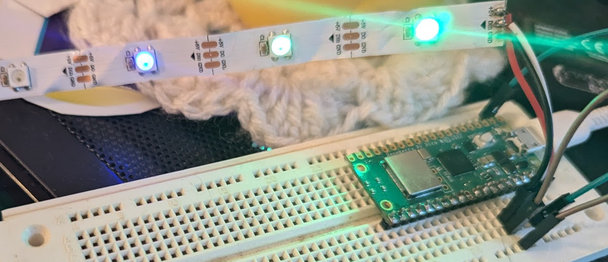
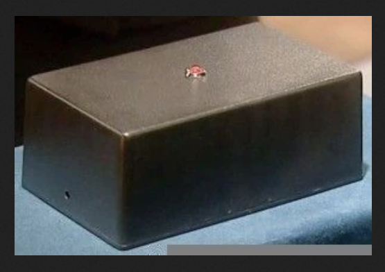
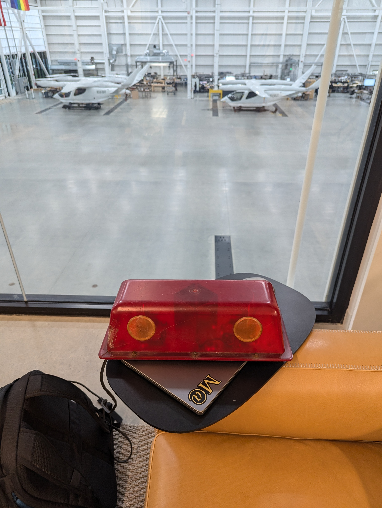

# sky-alarm

Create a device as described in https://xkcd.com/2979/

## Current State
Basic API calls and processing working

## Data Sources
* https://ipinfo.io
* https://worldtimeapi.org/api/timezone/{tzid}
* http://auroraslive.io/#/api/v1/all
* https://api.auroras.live/v1/?type=all&lat={lat}&long={lon}&forecast=false&threeday=false
* http://api.open-notify.org/iss-now.json
* https://api.sunrise-sunset.org/json?lat={lat}&lng={lon}&date=today&tzid={tzid}
* https://api.nasa.gov/neo/rest/v1/feed?start_date=2018-10-10&end_date=2018-10-10&api_key=DEMO
* https://launchlibrary.net/1.4/launch/next/5
* https://api.nasa.gov/planetary/apod
* https://opensky-network.org/api/states/all

## Hardware
* [Raspberry PI picoPI](https://www.raspberrypi.com/products/raspberry-pi-pico/)
* [Neopixels](https://www.adafruit.com/product/2541)
* Case : Work in Progress

## Case ideas
  
  
 

## Definition of Done
Working prototype delivered to XKCD